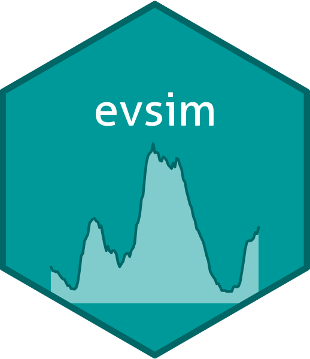

<!-- README.md is generated from README.Rmd. Please edit that file -->

# evsim <a href='https://mcanigueral.github.io/evsim/'></a>

<!-- badges: start -->
<!-- [](https://cran.r-project.org/package=dplyr) -->
<!-- [](https://github.com/tidyverse/dplyr/actions/workflows/R-CMD-check.yaml) -->
<!-- [](https://app.codecov.io/gh/tidyverse/dplyr?branch=main) -->
<!-- badges: end -->

## Overview

{evsim} is part of a suite of packages to analyse, model and simulate
the charging behavior of electric vehicle users:

- [{evprof}](https://mcanigueral.github.io/evprof/): Electric Vehicle
  PROFiling
- [{evsim}](https://mcanigueral.github.io/evsim/): Electric Vehicle
  SIMulation

{evsim} package provides the functions for:

- Simulating new EV sessions based on Gaussian Mixture Models created
  with package {evprof}
- Calculating the power demand from a data set of EV sessions in a
  specific time resolution
- Calculating the occupancy (number of vehicles connected) in a specific
  time resolution
- Including the EV model inputs in a Shiny Dashboard (a Shiny module is
  provided)

## Usage

If you have your own data set of EV charging sessions or you have
already built your EV model with {evprof}, the best place to start is
the [Get started
chapter](https://mcanigueral.github.io/evsim/articles/evsim.html) in the
package website.

## Installation

Since the package is not yet in CRAN, you can install the development
version of {evsim} from GitHub:

``` r
# install.packages("devtools")
devtools::install_github("mcanigueral/evsim")
```

## Getting help

If you encounter a clear bug, please open an issue with a minimal
reproducible example on
[GitHub](https://github.com/mcanigueral/evsim/issues). For questions and
other discussion, please send me a mail to <marc.canigueral@udg.edu>.

For further technical details, you can read the following academic
articles about the methodology used in this paper:

- **Electric vehicle user profiles for aggregated flexibility
  planning**. IEEE PES Innovative Smart Grid Technologies Europe (ISGT
  Europe). IEEE, Oct. 18, 2021. DOI:
  [10.1109/isgteurope52324.2021.9639931](10.1109/isgteurope52324.2021.9639931).
- **Flexibility management of electric vehicles based on user profiles:
  The Arnhem case study**. International Journal of Electrical Power and
  Energy Systems, vol. 133. Elsevier BV, p. 107195, Dec. 2021. DOI:
  [10.1016/j.ijepes.2021.107195](10.1016/j.ijepes.2021.107195).
- **Potential benefits of scheduling electric vehicle sessions over
  limiting charging power**. CIRED Porto Workshop 2022: E-mobility and
  power distribution systems. Institution of Engineering and
  Technology, 2022. DOI: [10.1049/icp.2022.0744](10.1049/icp.2022.0744).

## Acknowledgements

This work has been developed under a PhD program in the University of
Girona (Catalonia) in collaboration with
[Resourcefully](https://resourcefully.nl/), an energy transition
consulting company based in Amsterdam, The Netherlands. The author would
also like to thank the city of Arnhem, in particular Peter Swart, for
facilitating access to the data used in the validation stage of this
research.

------------------------------------------------------------------------
